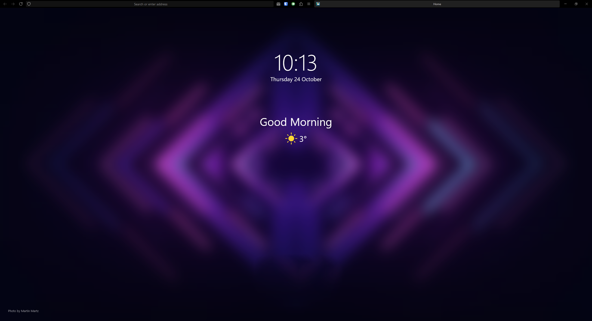
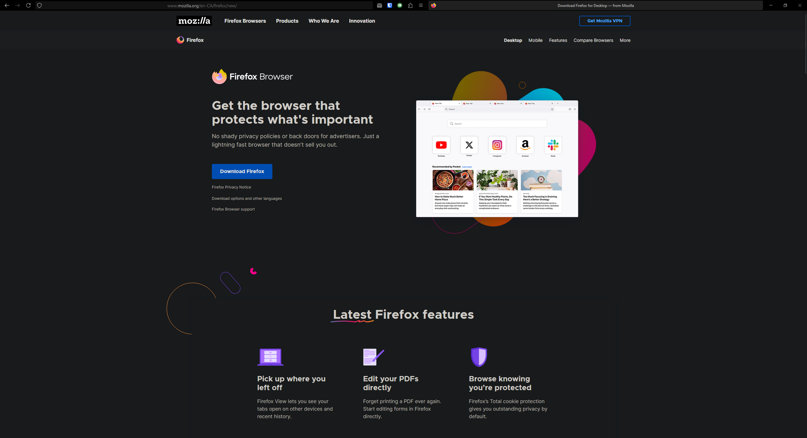

## 🚀 Description

-   Based on [MrOtherGuy's](https://github.com/MrOtherGuy) [firefox-csshacks](https://github.com/MrOtherGuy/firefox-csshacks) with some adjustments on top
-   Simple Oneliner with combination Navbar and Tabbar that fills the size of window
-   Page action buttons and tab close button changed to view on hover
-   Built for personal use on the latest Stable Firefox version

## ⚙️ Installation

1. In the searchbar type `about:config`. If a dialog is shown, press the **I accept the risk** button
2. Search for `toolkit.legacyUserProfileCustomizations.stylesheets` and change value to **True**
3. In the searchbar type `about:support` and look for entry with type as **Profile Folder** and select **Open Folder**
4. Move the `userChrome.css` and all other `*.css` files into the `chrome` directory within the profile folder:
5. Final structure will look like `<profileFolder>/chrome/userChrome.css`

## 🎨 Customization

Feel free to review and customize the `userChrome.css` file as required

## 💫 Preview

Full setup includes CSS files, [Bonjourr](https://bonjourr.fr/) as homepage and [Matt Black](https://addons.mozilla.org/en-US/firefox/addon/matte-black-browser-theme/) theme.
